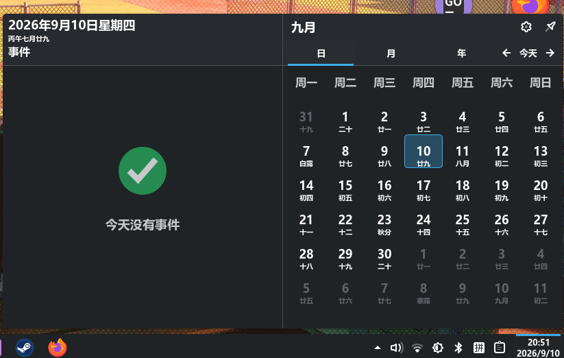
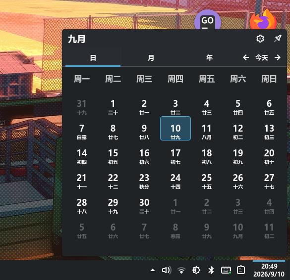
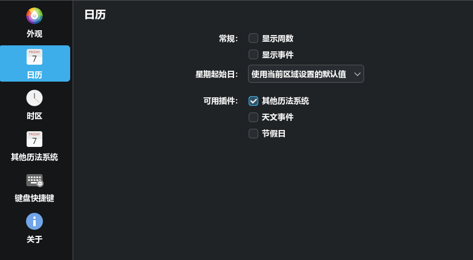

# Digital Clock - Same Size


基于 KDE 官方 [DigitalClock](https://invent.kde.org/plasma/plasma-workspace) 小部件改造的 Plasma 数字时钟插件。

本项目在保留原版「时间与日期等宽（Same size）」特性的基础上，进行了**中国本地化适配**，并新增了**事件显示开关**功能，更适合中文用户日常使用。

## 界面预览

**日历弹窗 · 事件面板开关对比**（左：开启，默认 · 右：关闭）：

| 显示事件 ✅ | 隐藏事件 ⬜ |
| :---: | :---: |
| [](screenshots/calendar-with-events.png) | [](screenshots/calendar-no-events.png) |
| 日历左侧显示当天日程面板，无日程时提示「今天没有事件」 | 仅显示日历，界面更简洁 |

**配置界面 · 配置 → 日历**：



## 特性

- ⏰ **等宽数字时钟**：时间与日期使用相同的字号尺寸，显示更统一美观。
- 🗓️ **日历弹窗**：点击时钟可展开完整的日历视图，支持周数显示、多时区世界时钟。
- 📅 **事件显示开关（新增）**：可在设置中开启或关闭事件面板，从日历插件读取日程事件并当天展示。
- 🌍 **多时区支持**：配置多个时区，支持滚轮切换时区、时区代码/全称/UTC 偏移多种显示方式。
- 🕐 **灵活的日期与时间格式**：支持 12/24 小时制、秒数显示、自定义日期格式、日期在时间旁/下方/自适应位置。
- 🔤 **字体样式配置**：自动字体与字号，或手动指定字体、粗细、斜体、大小。
- 🇨🇳 **中国本地化**：内置简体中文（`zh_CN`）翻译，适配中文使用习惯。

## 系统要求

- **Plasma 6**（KDE Plasma 6.x，`KPackageStructure` 为 `Plasma/Applet`）
- 依赖 Qt 6 与 `org.kde.plasma.workspace.calendar` 模块（Plasma 桌面自带）
- 事件面板需要至少启用一个日历事件插件（如「其他历法系统」「节假日」「天文事件」）

## 安装

### 方式一：从 Release 安装（推荐）

从 [Releases](https://github.com/keqing1314/samesizedigitalclock-cn/releases) 下载最新的 `*.plasmoid` 文件，然后：

1. 在桌面或面板上右键 →「添加小部件」
2. 点击「从本地文件安装小部件」
3. 选择下载的 `.plasmoid` 文件即可

### 方式二：从源码安装

将整个插件目录复制到 Plasma 小部件目录，例如：

```bash
# 用户级安装（推荐）
cp -r com.github.alex47.samesizedigitalclock ~/.local/share/plasma/plasmoids/

# 或系统级安装
sudo cp -r com.github.alex47.samesizedigitalclock /usr/share/plasma/plasmoids/
```

安装后在桌面或面板上右键 →「添加小部件」，搜索 **Digital Clock - Same Size** 即可使用。

> **更新已安装版本**：重新复制目录覆盖后，执行 `kquitapp6 plasmashell && kstart plasmashell` 重启 Plasma 使更改生效。

### 方式三：自行打包

```bash
python3 scripts/package_plasmoid.py dist
```

生成的 `dist/com.github.alex47.samesizedigitalclock-<版本>.plasmoid` 即可用于上述「从本地文件安装」。仅依赖 Python 3 标准库。

## 使用说明

- **左键点击时钟**：展开/收起日历弹窗。
- **滚轮**：在已配置的多个时区之间切换（需在 **配置 → 时区** 中开启「滚轮切换时区」）。
- **右键菜单**：复制当前时间/日期、配置、锁定位置等。
- **悬停提示框**：鼠标悬停显示完整日期、时区与秒数（取决于「秒数显示」设置）。

## 配置项

在时钟的右键菜单 →「配置」中可调整：

### 外观（Appearance）

| 设置项 | 说明 |
| --- | --- |
| 显示日期 | 是否在时间旁显示日期 |
| 日期位置 | 自适应 / 时间旁 / 时间下 |
| 秒数显示 | 从不 / 仅在提示框 / 始终 |
| 时区显示 | 仅与本地时区不同时 / 始终显示 |
| 字体与字号 | 自动或手动设置字体、字号、粗细、斜体 |
| 时间格式 | 12/24 小时制 |
| 日期格式 | 短日期 / 长日期 / ISO / 自定义 |

### 日历（Calendar）

| 设置项 | 说明 |
| --- | --- |
| 显示周数 | 是否在日历中显示周数 |
| **显示事件** | **是否显示事件面板（新增事件开关）** |
| 一周第一天 | 使用区域默认 / 周日 / 周一 / 周五 / 周六 |
| 可用插件 | 选择事件数据来源的日历插件 |

### 时区（Time Zones）

- 添加 / 删除 / 排序多个时区。
- 设置时区显示格式（代码、全称、UTC 偏移）。
- 开启「滚轮切换时区」后，可直接在时钟上滚动切换已配置的时区。

## 文件结构

```
├── metadata.json                  # 插件元数据（ID、名称、版本、类别、许可证等）
├── README.md                      # 项目说明
├── CHANGELOG.md                   # 版本更新日志
├── .github/
│   ├── release.yml                # 自动生成 Release Notes 的分类规则
│   └── workflows/
│       └── release.yml            # 推送 v* 标签时自动发布 Release
├── screenshots/                   # README 示例截图
├── scripts/
│   ├── package_plasmoid.py        # 打包 .plasmoid 安装包
│   └── extract_changelog.py       # 按版本提取 CHANGELOG 发布说明
└── contents/
    ├── config/
    │   ├── config.qml             # 配置分类模型
    │   └── main.xml               # 配置项定义（KConfig）
    ├── locale/
    │   └── zh_CN/                 # 简体中文翻译
    └── ui/
        ├── main.qml               # 小部件入口（紧凑表示 / 完整表示）
        ├── DigitalClock.qml       # 时钟紧凑表示
        ├── CalendarView.qml       # 日历弹窗（含事件面板）
        ├── Tooltip.qml            # 鼠标悬停提示框
        ├── NoTimezoneWarning.qml  # 无有效时区提示
        ├── configAppearance.qml   # 外观配置页
        ├── configCalendar.qml     # 日历配置页（含事件显示开关）
        └── configTimeZones.qml    # 时区配置页
```

## 事件显示开关（新增）

在 **配置 → 日历** 中勾选/取消「**显示事件**」即可控制事件面板的显隐。


- 开启后，会在日历左侧列出当天/所选日期的日程事件。
- 开关会读取 `enabledCalendarPlugins` 中已启用的日历插件数据。
- 若没有可用的事件插件，事件面板会自动隐藏。

### 效果对比

开启后日历左栏显示当天日程（无日程时提示「今天没有事件」），关闭后仅保留日历本体。对比截图见上方 [界面预览](#界面预览)。

## 常见问题

**Q：日历中不显示事件面板？**
A：请确认 配置 → 日历 中已勾选「显示事件」，且「可用插件」至少启用一项；若选择的插件没有任何数据，面板会显示「今天没有事件」而非隐藏。

**Q：修改后界面没有变化？**
A：Plasma 会缓存 QML，重启 `plasmashell` 或重新登录即可生效。

**Q：中文界面不显示？**
A：请确保系统语言为简体中文；`contents/locale/zh_CN/` 已内置翻译文件。

## 许可证

本项目基于 [GPL-2.0+](https://www.gnu.org/licenses/old-licenses/gpl-2.0.html) 发布，遵循原版 KDE Plasma 小部件许可。

- 原始作者：Martin Klapetek 及其他 KDE 贡献者（[plasma-workspace](https://invent.kde.org/plasma/plasma-workspace)）
- 本项目仓库：[keqing1314/samesizedigitalclock-cn](https://github.com/keqing1314/samesizedigitalclock-cn)
- Bug 报告与建议：[GitHub Issues](https://github.com/keqing1314/samesizedigitalclock-cn/issues)
- 版本历史：[CHANGELOG.md](CHANGELOG.md) · [Releases](https://github.com/keqing1314/samesizedigitalclock-cn/releases)

## 发布新版本

1. 更新 `metadata.json` 中的 `KPlugin.Version`。
2. 在 `CHANGELOG.md` 顶部新增对应条目，格式为 `## [x.y.z] - YYYY-MM-DD`。
3. 提交并推送标签：

   ```bash
   git add -A
   git commit -m "chore(release): 发布 vX.Y.Z"
   git tag -a vX.Y.Z -m "vX.Y.Z"
   git push origin main --follow-tags
   ```

4. GitHub Actions 会自动执行 [`release.yml`](.github/workflows/release.yml)：
   - 从 `CHANGELOG.md` 提取该版本说明作为 Release 正文
   - 打包 `.plasmoid` 安装包并作为附件上传
   - 创建对应的 Release

也可以在仓库 **Actions → Release → Run workflow** 中手动输入已存在的标签补发 Release。

## 贡献

欢迎提交 Issue 或 Pull Request。若修改了界面文案，请同步更新 `contents/locale/zh_CN/` 下的翻译文件。
